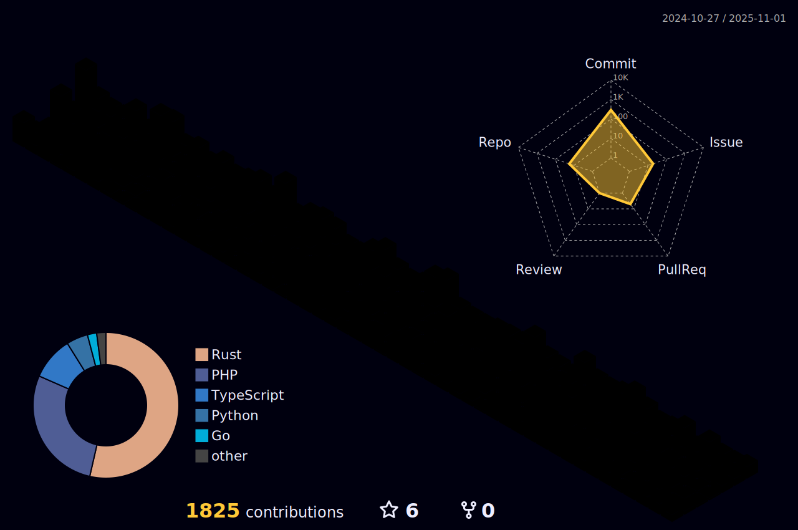

# akhaled01

Hello! My name is Abdulrahman Idrees, and I'm a full-stack developer in training at Reboot01, and I'm passionate about learning new technologies and solving complex problems. When I'm not coding, you can find me studying at the University of Bahrain 🎓, where I'm pursuing my degree in Cybersecurity.

* 🇧🇭  I'm based in Bahrain
* ✉️   You can contact me at [akhaledlarus@gmail.com](mailto:akhaledlarus@gmail.com)
* 🧠  I'm learning Tech Stacks for web development, and the basics of sysAdmin and cybersecurity! 

### Skills

### Socials

 <a href="https://www.github.com/akhaled01" target="_blank" rel="noreferrer"> <picture> <source media="(prefers-color-scheme: dark)" srcset="https://raw.githubusercontent.com/danielcranney/readme-generator/main/public/icons/socials/github-dark.svg" /> <source media="(prefers-color-scheme: light)" srcset="https://raw.githubusercontent.com/danielcranney/readme-generator/main/public/icons/socials/github.svg" />  </picture> </a> <a href="https://www.linkedin.com/in/abdulrahman-khaled-430012256" target="_blank" rel="noreferrer"> <picture> <source media="(prefers-color-scheme: dark)" srcset="https://raw.githubusercontent.com/danielcranney/readme-generator/main/public/icons/socials/linkedin-dark.svg" /> <source media="(prefers-color-scheme: light)" srcset="https://raw.githubusercontent.com/danielcranney/readme-generator/main/public/icons/socials/linkedin.svg" />  </picture> </a> <a href="https://www.stackoverflow.com/users/22939771" target="_blank" rel="noreferrer"> <picture> <source media="(prefers-color-scheme: dark)" srcset="undefined" /> <source media="(prefers-color-scheme: light)" srcset="https://raw.githubusercontent.com/danielcranney/readme-generator/main/public/icons/socials/stackoverflow.svg" /> </picture> </a>

<!--  -->

## My Stats

 
 

